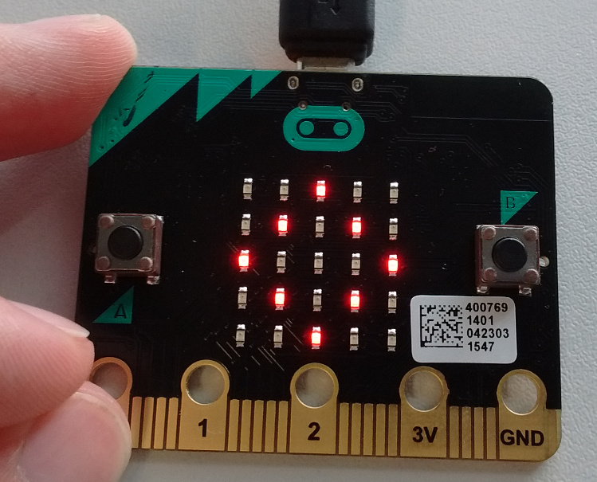

The micro:bit is a single-board computer designed by the BBC as a way to learn
about programming. It is being delivered to all year seven students (11-12) in
the UK.

The micro:bit has a 5x5 grid of red LEDs, two buttons, an accelerometer and a
compass. There are also pins to connect components like motors or speakers.

MicroPython is a variant of the Python programming language that runs on such
tiny computers. It's a powerful way to program the micro:bit. For tutorials
and reference information, see `BBC micro:bit MicroPython
<http://microbit-micropython.readthedocs.org/en/latest/index.html>`__.

`Jupyter <http://jupyter.org/>`__ is a set of tools for interactive programming.
This package allows Jupyter interfaces to run MicroPython code directly on the
micro:bit.

Set-up steps:

1. Plug in your micro:bit and ensure it has MicroPython on it. To do this,
   `create a Python script in the web editor <https://www.microbit.co.uk/app/#create:xyelfe>`__,
   and follow the instructions there to flash it onto the micro:bit. It doesn't
   matter for this what the script does.

2. Depending on your system, you may need some extra setup so that the kernel
   can talk to your micro:bit using a serial port.

   * On Linux, you may need to add yourself to the *dialout* group.
     Run ``sudo usermod -a -G dialout <your-username>``, then log out and in again.
   * On Windows, you need to `install the mbed driver
     <https://developer.mbed.org/handbook/Windows-serial-configuration>`__.

3. `Install Jupyter <http://jupyter.readthedocs.org/en/latest/install.html>`__.
4. Install this package::

       pip install ubit_kernel
       python3 -m ubit_kernel.install

When you start the Jupyter Notebook, there should be a *micro:bit* option in the
menu to create a new notebook.

To use the kernel from other Jupyter interfaces, start them with ``--kernel ubit``.
